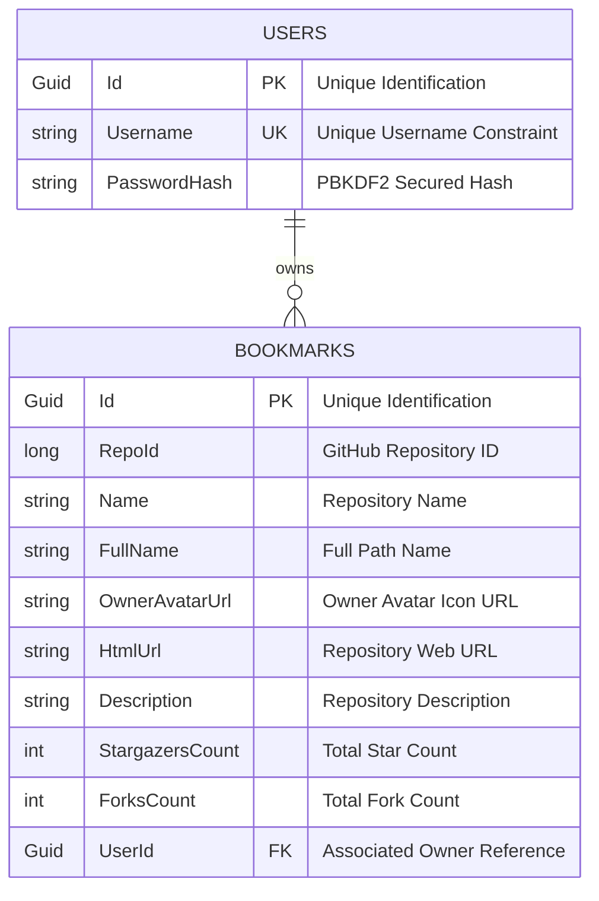

# 🌌 Github Search Repositories (FNX)

A premium, highly interactive, and beautiful Github Repository Search & Bookmark Management dashboard. Built with a modern glassmorphic dark-theme design system, fully reactive Signal-based state management, and a robust, secure ASP.NET Core relational SQLite backend.

---

## ✨ Features

- **🔍 Proxy GitHub Search**: High-performance querying of the official GitHub API via a dedicated backend proxy, returning up to 100 repositories in a single request.
- **📂 Relational Bookmarks**: Fully-synced relational database (SQLite) mapping user bookmarks, allowing users to save, view, and delete their favorite repositories with instant UI updates.
- **🎨 Modern Glassmorphic Design**: Sleek deep-dark responsive cards, premium hover highlights, glowing box-shadows, and smooth micro-animations.
- **🚨 Unified Error Handler & Loader**: Responsive global loading animations and custom slide-in bottom-right glassmorphic error toasts with 10s auto-dismiss.
- **🛡️ Secure Route Guarding**: Native functional `isLoginGuard` route validation that secures dashboard spaces (`/system`) from unauthenticated access.
- **📱 Fully Responsive**: Custom CSS media queries adjusting grid systems, margins, and rendering specific lightweight layouts for desktop and mobile viewports.

---

## 🛠️ Tech Stack

### Client (Frontend)
- **Framework**: Angular v20+ (using modern functional routing and standalone component patterns)
- **State Management**: Angular Signals (fully reactive, eliminating redundant manual subscription loops)
- **Styling**: Vanilla CSS (custom glassmorphism, blurs, and micro-interactions)
- **UI Components**: Angular Material components (tabs, input fields, and layouts)

### Server (Backend)
- **Framework**: C# ASP.NET Core Web API (.NET 8+)
- **Database**: Entity Framework Core with SQLite (embedded file-based database for zero external config)
- **Security**: PBKDF2 Password Hashing (`Microsoft.AspNetCore.Identity.PasswordHasher`), JWT Bearer Token validation

---

## 🚀 How to Run the Project

### 1. Run the Backend Server (.NET)

The C# backend is fully portable and uses a self-initializing SQLite database. It automatically provisions the schema on first startup, meaning **no manual migrations are required**.

1. Navigate to the server directory:
   ```bash
   cd server/GithubSearch.Api
   ```
2. Restore dependencies and run the application:
   ```bash
   dotnet run
   ```
   *Alternatively, you can run `dotnet watch` to start the server with hot-reload enabled.*

3. **Backend Status**: The server runs on local HTTP: `http://localhost:5000`.

---

### 2. Run the Client Application (Angular)

Ensure you have [Node.js](https://nodejs.org/) installed on your machine.

1. Navigate to the client directory:
   ```bash
   cd client/github-search
   ```
2. Install npm dependencies:
   ```bash
   npm install
   ```
3. Start the local development server:
   ```bash
   npm run start
   ```
   *This starts the Angular compiler and runs the application locally.*

4. **Access the App**: Open your browser and navigate to `http://localhost:4200`.

> [!NOTE]
> **First Run Instruction**: On the first run, the newly created database is completely **empty**. You will need to start by **registering a new account** on the landing page before you can log in and explore the dashboard!

---

## 📂 Project Structure

```text
├── client/                     # Angular Single Page Application
│   └── github-search/
│       ├── src/
│       │   ├── app/
│       │   │   ├── components/  # Reusable widgets (ResultCard, ErrorToast, Header, etc.)
│       │   │   ├── guards/      # Route authentication guard (isLoginGuard)
│       │   │   ├── pages/       # Core pages (Home/Landing, System Dashboard)
│       │   │   └── services/    # Reactive communication handlers (Auth, User, General)
│       │   └── styles.css       # Global aesthetics and mobile overrides
│
└── server/                     # ASP.NET Core Web API
    └── GithubSearch.Api/
        ├── Controllers/        # Auth, Bookmarks, and GitHub Proxy endpoints
        ├── Database/           # DbContext and SQLite Relational models
        ├── Dtos/               # Data Transfer Objects with snake_case naming maps
        └── Services/           # GitHub proxy logic and business managers
```

---

## 🔒 Security & Relational Database Design

The server utilizes an embedded SQLite instance (`github-search.db`) that manages user records and bookmark relations cleanly:


